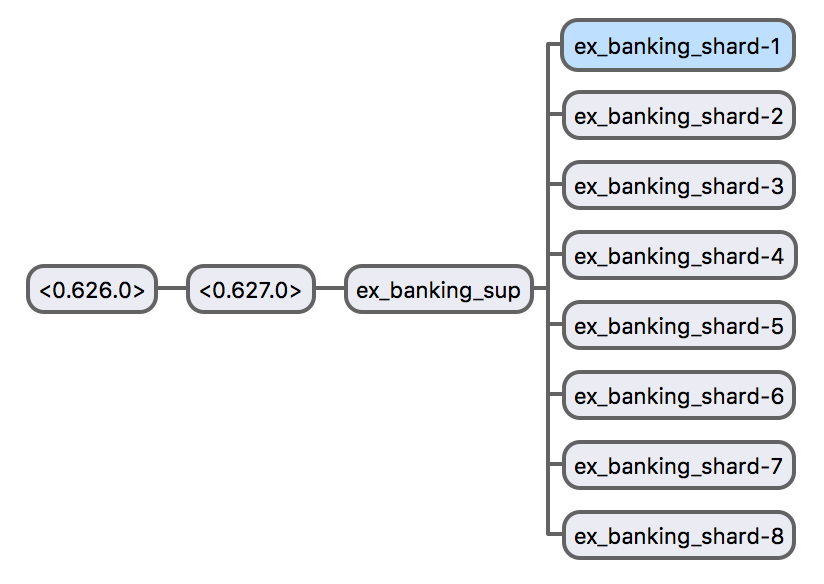

# ex_banking

This application was written as a solution to [Heathmont's elixir test](https://github.com/heathmont/elixir-test), but implemented in erlang. With maximum respect to original requirements, I say: `:ex_banking.*` functions should behave in the same way as required `ExBanking.*` functions.

**TL;DR**: Tested on erlang 20.0. `make all test dialyze` to test, `make all run-release` to run.

## Data structures

Application uses three different data structures: `operation`, `account` and `user`. All data structures are covered with some unit tests in [`test`](apps/ex_banking/test) directory (`*_tests.erl`).

### `operation`

See [`ex_banking_operation.erl`](apps/ex_banking/src/datastructures/ex_banking_operation.erl).

This is an abstraction of operation in the system. Every operation is unique (`ex_banking_operation:id/1`) and contains operation `type` (`deposit | withdraw`) and amount. Every `account` mutation is to be performed with `operation`.

### `account`

See [`ex_banking_account.erl`](apps/ex_banking/src/datastructures/ex_banking_account.erl).

This is an absraction of user account in the system. Account here is amount of money of some known currency that user holds. Data structure contains information about account currency, amount of money and a list of active operations.

`ex_banking_account` provides an interface for two-phase transaction execution: see `plan_deposit/2`, `plan_withdraw/2`, `commit/2`, `rollback/2` functions.

### `user`

See [`ex_banking_user.erl`](apps/ex_banking/src/datastructures/ex_banking_user.erl).

This is an abstraction of user in the system. Data structure contains information about user itself (`ex_banking_user:id()`) and a list of accounts that user holds. New accounts are created on-demand.

## Transactions

Application contains somehow naive implementation of two-phase transaction mechanism.

* on `deposit` user `account` stores `operation` with related information. On `commit`, `operation` is being resolved by adding funds to user `account`. On `rollback`, `operation` is being dropped.

* on `withdraw` user `account` stores `operation` with related information. Unlike `deposit`, `account` "blocks" funds by reducing available funds by withdrawal amount. On `rollback`, `operation` is being resolved by adding "blocked" funds back. On `commit`, `operation` is being dropped.

* `send` implementation mixes two operations.

## Concurrency

Race conditions (creating new users) and concurrency control (operations) problems are solved with a pool of worker shards that are started on application bootstrap (see [`ex_banking_shard.erl`](apps/ex_banking/src/ex_banking_shard.erl)). Operations for every single user are being processed on a single worker, chosen with consistent hashing algorithm. Thus, all operations for every single user are serialized. NB: shard also holds a limitation for maximum 10 operations per user.

Common tests suites may be found in [`test`](apps/ex_banking/test) directory (`*_SUITE.erl`).

## Supervision tree

## Known issues

* All operations in the system are performed with integers instead of floats with ignoring insignificant bits, so `1.009` amount is casted to `1.0`. The proper solution will include some decimal arithmetic library like [this](https://github.com/tim/erlang-decimal) or [that](https://github.com/egobrain/decimal) with errors on calls with invalid amounts.

* Some of data abstractions should be refactored and fixed. For example, [`operation`](apps/ex_banking/src/datastructures/ex_banking_operation.erl) data structure probably should contain information about user and currency, so you will be able to get all related information within one structure when facing some runtime problems.

* Such financial systems should have write-ahead log; however, original list of acceptance criteria contains a requirement not to use any disk storage, so write-ahead log was skipped.

* Such system capacity is described in shards count or worker pool size. For demonstration purposes `shards_count` is set to `8` (see [`sys.config`](config/sys.config)). This naive implemetation of sharding, of course, should never be used in production since it does not scale.

* `send` operation is being processed seqentially, but it may be partially parallellized.

* `send` operation implementation is quite dirty.

* `operation_failed` error was added as a marker of some really bad thigs happened (`commit` or `rollback` failure).

* [`ex_banking_shard.erl`](apps/ex_banking/src/ex_banking_shard.erl) use ETS tables. `dict`s are sometimes faster. However, for now changing ETS to `dict` is quite tricky because of dirty code inside the `ex_banking_shard` module.

* Maximum number of operations per user is hardcoded in the [`ex_banking_shard`](apps/ex_banking/src/ex_banking_shard.erl) module and [`send_SUITE`](apps/ex_banking/test/send_SUITE.erl) test suite. In proper solution it should be configurable.
